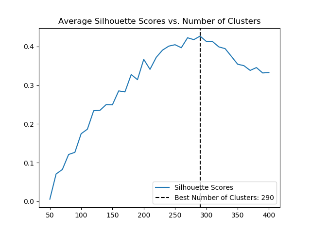
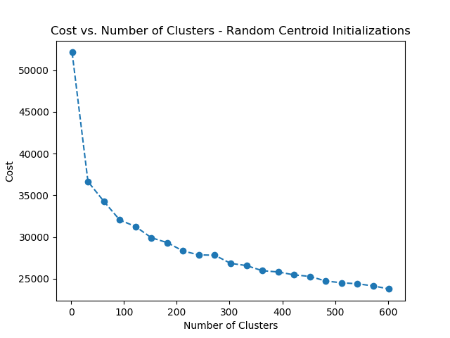
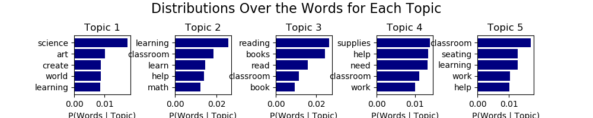
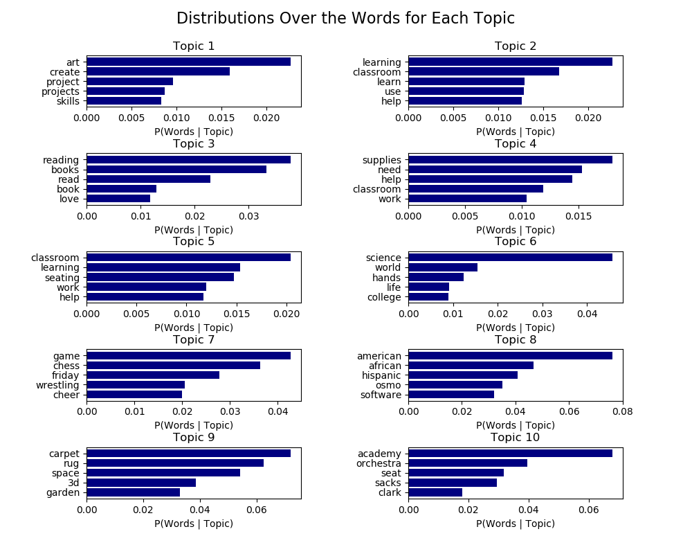
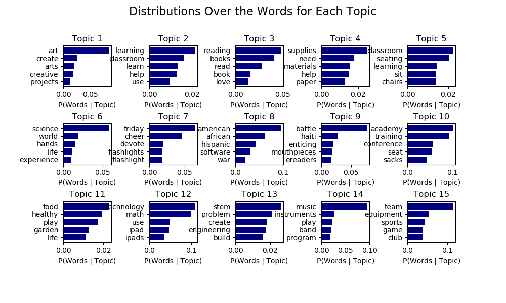
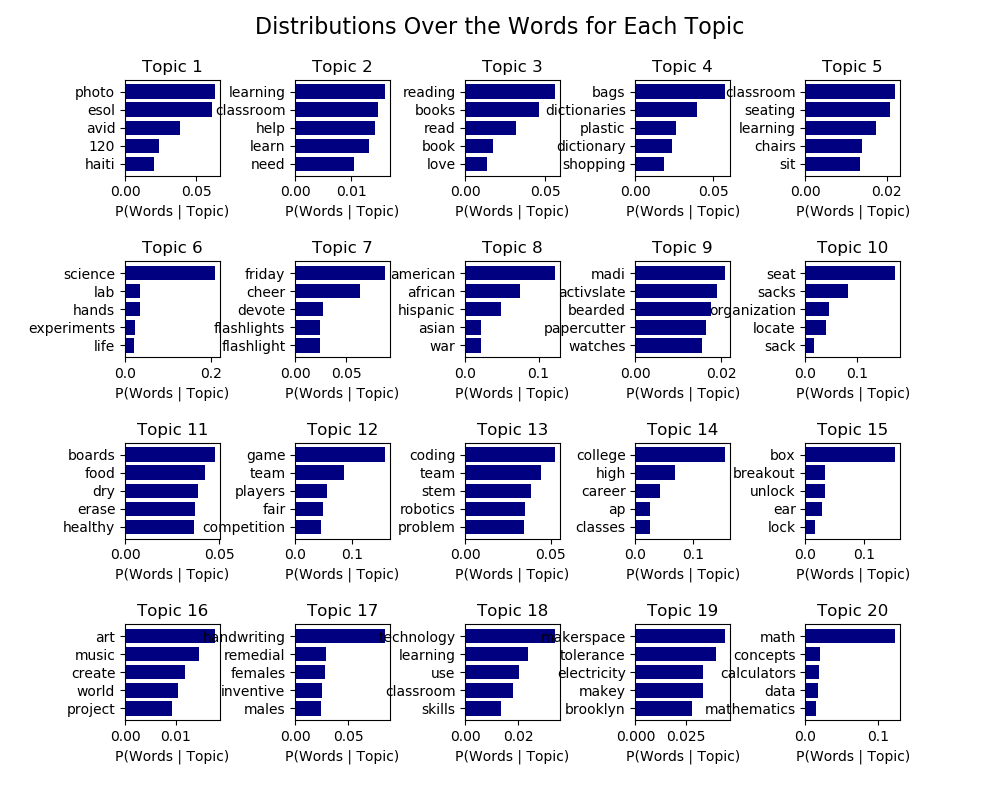

# DonorsChoose.org Project Recommender  

## Background:
[DonorsChoose.org](https://www.donorschoose.org/) is a crowdfunding site specifically for teachers and schools. Teachers submit projects to DonorsChoose.org, who vets the projects, posts them, handles the transactions, fulfills the project requests and ships the items to the teacher and school who posted the project.

Some quick stats about donations, projects, and donors:
- The average donation is $60.
- Average Project cost is around $740.
-- The lowest project cost: $35 for seeds for a science project.
-- The highest project cost: $258,000 to fund Olympic Fencing Programs.
-- On average, it takes a project 5 donors to fund fully.
-- 74% of projects are funded fully.
- 72% of donors make only 1 donation.

## Project: Build a project recommender to surface projects similar to the projects to which donors have already donated, hopefully to increase the rate of repeat donations.

## Data
Sourced from Kaggle ([competition here](https://www.kaggle.com/c/donorschoose-application-screening)). Since the competition was over, I did my own thing with the data you get if you click the "download all" link.

In total, there were 1.1 million projects, which I subsetted to 11,000 for time and efficiency.

In addition to project information, each school had some interesting features, which I joined in with the projects.

I ended up with two different Feature Matricies for my two different analysis strategies. For clustering, I worked with the categorical data already aggregated by DonorsChoose. Here are those features and some examples of their unique values:

| 'Project Title | Project Resource Category (17) | Project Subject Category Tree (46) |Project Subject Subcategory Tree (320) | Project Type (3) |School Metro Type (5) | Region (4) | Project Grade Level Category (4) |
| --- | --- | --- | --- | --- | --- | --- | --- | --- | -- |
|n/a | Supplies, Books, Lab Equipment, Food, Clothing & Hygiene | Math & Science Health & Sports, Special Needs Literacy & Language | History & Geography, Other, Health & Wellness, Performing Arts, Character Education, Economics,  Civics & Government, College & Career Prep Environmental Science, Nutrition Education | Teacher-Led, Professional Development, Student-Led |Suburban, Rural, Urban, Unknown, Town | South, Midwest, West, Northeast| Suburban, Rural, Urban, Unknown, Town |  

For topic analysis, I used the Title of the Project concatenated with a full project essay. Here's a part of a project essay:

```Our students need more time to play, construct, and learn.
We are requesting funding to purchase STEM related games and activities, including Robot Turtles Game, Camelot Jr. Game, Dominoes, LEGO Chain Reactions Kit, Mental Blox Critical Thinking Game, Q-Ba-Maze Game, Gravity Maze, and much more.
We will put out 4-5 different STEM activities each week.  Each week, students will be assigned a different station, this will allow students to explore all the different games and activities. [...]
Our students will greatly benefit from this project because  these STEM games/activities will help enrich our classroom and help my students develop their STEM skills. These materials will help foster a collaborative classroom environment. [...]
```


## Recommend Based on Clusters of Existing Categories
### K-means Clustering



As I learned when I inspected the clusters, k-means clustering isn't great for high-dimensional categorical values, because the space becomes very sparse. With 290 clusters, a lot of the projects were alone in their clusters. (Not useful for a recommender).


### K-mode Clustering
K-modes clustering works very similarly to KMeans. Here's the pseudocode:

``` python
k_modes(categorical_data):
  #randomly designate centroids, by picking random rows of your data.
  #assign each data point to it's centroid by picking centroids that minimize the dissimilarity measurement between the data point and the centroid.
  #until convergence:
    #make new centroids by taking the most common value for each feature (mode) in that cluster
    #re-assign each data point to minimize dissimilarity between the data point and the centroids
```

Dissimilarity is calculated between each data point and the centroid. A value of one is given to features that are categorial mis-matches, and a value of 0 is given to the features that match. The dissimilarity is a summation of those values, so the larger
the number of mismatches of categorical values between the data point and the centroid is, the more dissimilar the two objects. [More Information Here.](http://www.irma-international.org/viewtitle/10828/)

The cost function is defined as the sum distance of all points to their respective cluster centroids, so it's the total dissimilarity of all the points to their respective cluster centroids. Much like with SSE and k-means clustering, you're looking for an inflection point.


#### Recommendations Methodology:
A new project is assigned a cluster, then three other projects from that cluster are returned.

| Seed Project Title | Recommendation 1 | Recommendation 2 | Recommendation 3 |
| --- | --- | --- | --- |
| Civics + Economics = Fun Learning!| Boomwhacking Our Way To Understanding Sound Waves | Dress to Impress! | Give Us a Boost and Recharge Our Learning |
| Supporting STEM Careers | Supporting STEM Careers | Molecule Kits for Visualizing Chemistry | Collecting and Analyzing Data |
| Teaching the Common Core with Centers! | Bringing in the Noise with Kindergartners! | Art Smart Scholars Need to See Skills Sharpening! | Adding a Little Color to The World of Kindergarten!
| Muntu Field Trip | Technology Teacher Without Technology | Ms. DeLaCruz's Tech-Savvy Tigers | Protective Cases for Our Kindle Fires!
| No More Criss Cross Applesauce | 1st Graders Move and Groove With Technology! | Happy Stream, Happy Team! | Chromebooks For Kids
|  Super Supplies! | Writing Wizards | Colors, Colors Everywhere... Create A Picture If You Dare | Building Creative Solutions With Osmos


## Recommend Based on Document Topic Distributions Using LDA


### Words to Vectors
I used SKLearn's CountVectorizer to calculate a term frequency matrix.

| Parameter | Value |
| --- | --- |
| ``max_df`` (corpus-specific stop words) | .9 |
| ``stop_words`` | 'english' + 'school' |
| ``max_features`` | 10000 |
| ``min_df`` | 1 |
| ``n_gram_range`` | (1, 1) |

### Hyperparameters

| Parameter | Value |
| --- | --- |
| ``doc_topic_prior`` (alpha) | None (1 / n_components) |
| ``topic_word_prior`` (Beta) | None (1 / n_components) |
| ``learning_method`` | 'online' |
| ``learning_decay`` | .7 |
| ``learning_offset`` | 50. |

* The ``doc_topic_prior`` and ``topic_word_prior``
* Online variational Bayes method. In each EM update, use mini-batch of training data to update the ``components_`` variable incrementally. Learning rate is controlled by ``learning_decay`` and the ``learning_offset`` parameters.

### Choosing Topics
#### 5 Topics


#### 10 Topics


#### 15 Topics


#### 20 Topics


#### Analysis
15 topics looks like the way to go - Each of the topics is specific and distinct. Here's what I named the topics.

| Topic Interpretation | Words |
| --- | --- |
| Art  | art, create, arts, creative, projects |
| Classroom Necessities | learning, classroom, learn, help, use |
| Books | reading, books, read, book, love |
| Student Basic Needs | supplies, need, materials, help, paper |
| Classroom Furniture | classroom, seating, learning, sit, chairs |
| Hands-on Science | science, world, hands, life, experience |
| Extracurricular Activities | friday, cheer, devote, flashlights, flashlight |
| Refugee Resources or International Projects | American, African, Hispanic, software, war |
| 9 | battle, Haiti, enticing, mouthpieces, ereaders |  
| Teacher Training | academy, training, conference, seat, sacks |
| Gardening and Food | food, healthy, play, garden, life |
| Technology Supplies | technology, math, use, ipad, ipads |
| STEM Labs | stem, problem, create, engineering, build |
| Music | music, instruments, play, band, program |
| Sports Equipment | team, equipment, sports, game, club |

## Future Work:
Cluster Recommendation Architecture:
- When a donor is selected, the project that they've donated to is assigned to a cluster, and then three other projects from that cluster are randomly selected and surfaced for that donor. If a donor has donated to more than one project, one of the projects is randomly selected to be the 'seed' project.

LDA Recommendation Architecture:
- When a donor is selected, the essay of the project that they've donated to is given a document-topic distribution, and then three projects with the closest document-topic distributions are returned.

## Tools Used
- Pandas
- Numpy
- MatPlotLib
- SKLearn
- [KModes](https://pypi.org/project/kmodes/)

## References
