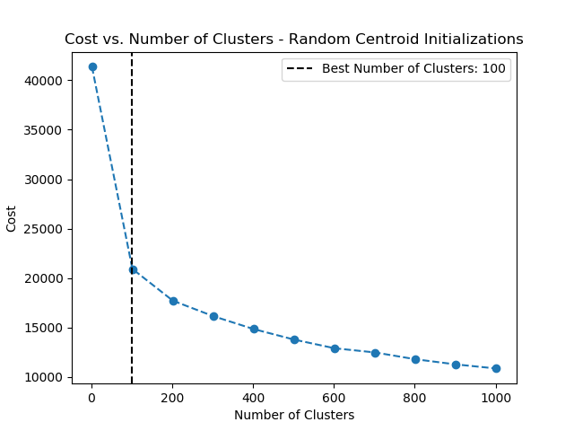

# DonorsChoose.org Project Recommender  

## Background:
[DonorsChoose.org](https://www.donorschoose.org/)

## Question:

## Data

## Clustering Strategies
### K-means Clustering

Kmeans isn't suitable for high-dimensional categorical values, because you run into sparse data. In practice, this meant that a lot of my clusters at my best silhouette score were alone in their clusters.

I tried to see if I could find some point that traded off silhouette score with minimum cluster size or average cluster size.

No matter how many clusters I used, there were always clusters with only one project. Not useful for a recommender, since you need to be able to pull from the clusters to recommend other, similar projects.

### K-mode Clustering
K-mode works very similarly to KMeans in the mechanics: it finds centroids, calculates 'distance' from points to centroids, and iterates until the assignments don't move. Instead of distance, k-modes calculates 'dissimilarity'. Between each data point and the centroid, a value of one is given to features that are categorial mis-matches, and a value of 0 is given to the features that do match. The dissimilarity is a summation of those values, so the larger
the number of mismatches of categorical values between the data point and the centroid is, the more dissimilar the two objects. K-mode then assigns data points to centroids based on smallest values of dissimilarity. [More Information Here.](http://www.irma-international.org/viewtitle/10828/)

Cost function is defined as the sum distance of all points to their respective cluster centroids. (Total dissimilarity of all the points to their respective cluster centroids, so you're attempting to minimize the total dissimilarity among all the clusters.)

#### Clusters vs DonorsChoose Categories

| Unique Values | Project Resource Category | Project Subject Category Tree | Project Subject Subcategory Tree | Project Type | School Metro Type | Region | Project Grade Level Category |
| ------- | ------- | --------- | --------- | --------- | --------- | --------- | --------- | ---- |
| Number Of unique values| 17 | 46 | 320 | 3 | 5 | 4 | 4 |
| Number of unique values in 100 centroids | 9 | 23 | 41 | 3 | 5 | 4 | 4|
| Number of unique values in 200 centroids | 13 | 25 | 67 | 3 | 5 | 4 | 4|
| Number of unique values in 200 centroids | 16 | 28 | 82 | 3 | 5 | 4 | 4 |

## Tools Used
- Pandas
- Numpy
- MatPlotLib
- [KModes](https://pypi.org/project/kmodes/)

## References
